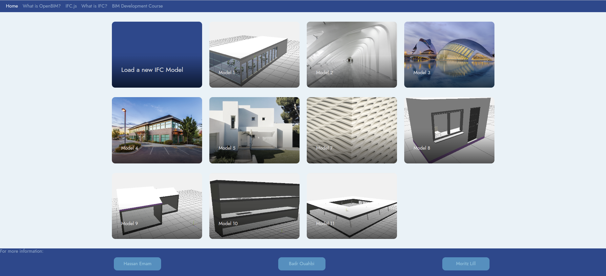
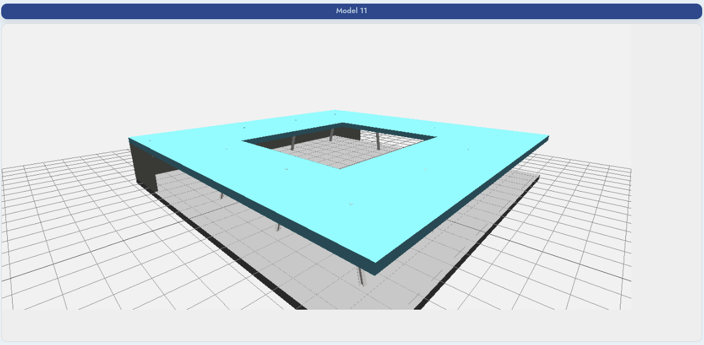
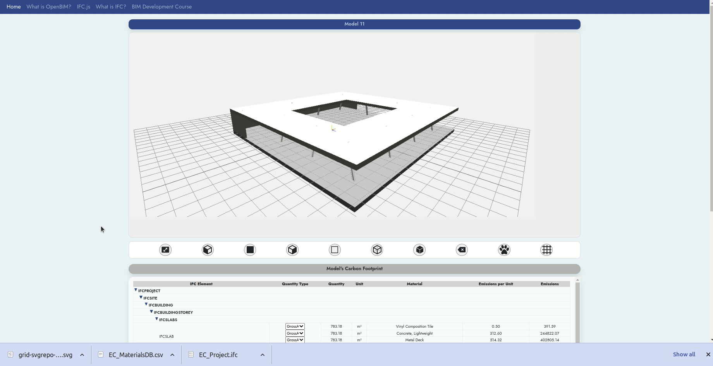
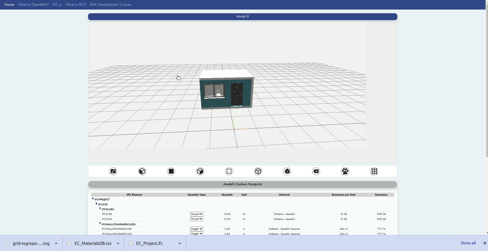
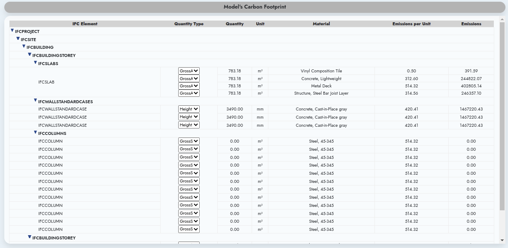

# Ifc.js - 6D

## Introduction

This project was created as part of the Ifc.js crash course hackathon. The project is developed by three of the course alumni ([HassanEmam](https://www.linkedin.com/in/hassanemam/), [Badr Ouahbi](https://www.linkedin.com/in/ouahbi/) and [Mortiz Lill](https://www.linkedin.com/in/moritz-lill/)).
The main purpose of the application is to perform 5D operations as Quantity Takeoff and 6D simulation (carbon emissions and footprint calculations). The project is a proof of concept and data used for carbon calculations are not real factors

## How to access the application

Web applications are super easy to use as they do not require any setup or installation to get started. Our web app is no different; all you need to do is to [click here to get started](https://hassanemam.github.io/ifcjs-6d/)

## Project Gallery

The project gallery includes some sample preloaded models to explore and test the project if users do not have IFC files.However, we do allow loading of IFC file by clicking the first card in the gallery page titled "Load a new IFC file."

## Geometry Viewer Functionality

The geometry viewer is a web application that allows users to view the 3D geometry of an IFC model. we have used the [three.js](https://threejs.org/) library to create the viewer, Ifc.js including [web-ifc](https://github.com/IFCjs/web-ifc) and [web-ifc-three](https://github.com/IFCjs/web-ifc-three) to parse the IFC file.

On top of the viewer is the project name. The viewer has multiple controls implemented to allow users to zoom, pan, rotate and change the view. The application allows user controls either by mouse or keyboard.

Keyboard controls using WASD and arrows where:

- W, A, S, D keys to move
- arrow keys (left, right, up, down) to rotate

Mouse controls using the mouse wheel and the mouse buttons as follows:

- left mouse button to rotate
- right mouse button to pan
- middle mouse button to zoom in/out

## Tools

We have created mutiple tools that we believed to be useful for the purpose of the project. These tools are found in a toolbar below the 3D viewer as shown in the image below. The tools in order are:

- Zoom extens: allows users to set the zoom to see all model elements in the viewer
- Left-side view: allows users to set the view to the left of the model
- Front-side view: allows users to set the view to the front of the model
- Right-side view: allows users to set the view to the right of the model
- Back-side view: allows users to set the view to the back of the model
- Wireframe: allows users to view the model in wireframe mode
- Textured: allows users to view the model in textured mode
- remove measurements: allows users to remove all measurements from the viewer
- Carbon Footprint: allows users to view the carbon footprint of the model with 5 grades of colors (green to red)
- Grid toggle: allows users to toggle the grid on and off

In addition to the tools, we have also created a toolbar that is found at the bototm of the viewer, we have included a measurement tool. This tool allows users to measure the distance between two points in the 3D viewer. To activate the tool, the user has to hold the shift key and click on the two points that they want to measure as illustrated in the image below.

## Hierarchical Table

The heirarchical table allows users to view the IFC model in a hierarchical table format. The table is created by parsing the IFC file and creating a tree structure. We did perform grouping within the spatial structure of the IFC to group elements of the same classes. The table is created by traversing the tree and creating a table for each node. The table has the following columns:

- IFC class: the class of the element
- Quantity Type: this allow users to select the quantity type to be displayed in the table (e.g. area, length, volume)
- Quantity: the value of the quantity type
- Unit: the unit of the quantity type which changes dynamically based on selected quantity and IFC types definition
- Material: the list of materials for each element. Some items have more than one material, we have displayed all of them with their relevant quantities
- Emission per unit: the carbon emission per unit of the element
- Emission: the carbon emission of the element and material type.

## Furture Works

We would hope to perform some optimisation in the future including

- [ ] optimisation of the rendering of the model
- [ ] optimisation of the data processing
- [ ] performe computational geometry analysis to calculate quantities from geometries to improve the user experience specialy for models with no quantities.
- [ ] generating a report of the results
- [ ] maintain a database of material properties and emissions
- [ ] develop an optimisation tool to minimise the carbon footprint of the model by proposing alternative materials
